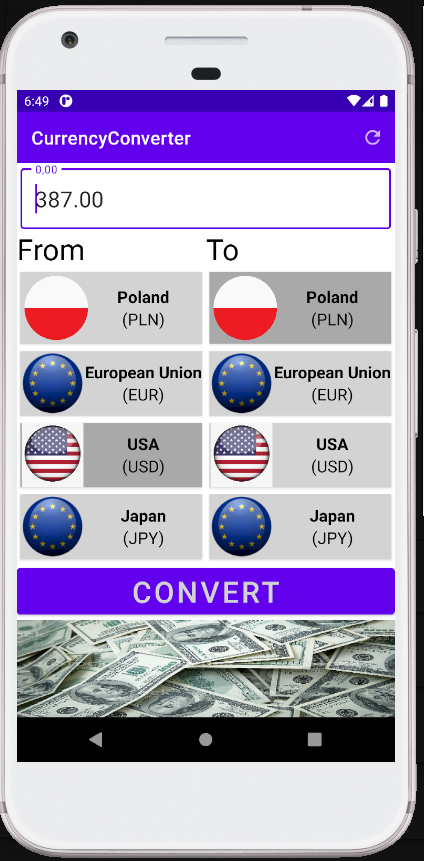
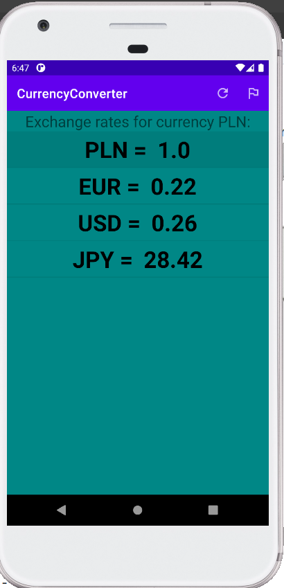
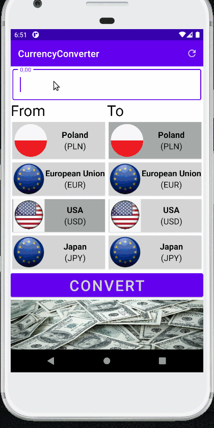
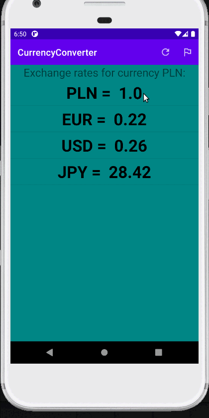

# CurrencyConverter
https://v6.exchangerate-api.com
Basic app for converting amounts of cash between four currencies. Each currency is represented by countr flag and name.
Exchange rates are downloaded from https://v6.exchangerate-api.com

Features:
-
- converting amounts between PLN, EUR, USD, JPY,
- select from nad to currency, selected currencies change colors to gray,
- displaying exchange rates for selected currency,
- currency for which exchange rates are displayed can be changed with drop down menu.

Used technologies:
-
- kotlin,
- dimens and string resuources,
- custom menu,
- java url request for downloading exchange rates,
- gson,
- listview with custom adapter for displaying calculated exchange rates,
- view binding for finding views in layouts.

App Screenshots
-
Start screen         |  Exchange rates screen
:-------------------------:|:-------------------------:
  |   

App during usage
-
Calculating exchange amount from value         |  Change currency for which exchange rates are displayed
:-------------------------:|:-------------------------:
  |   
